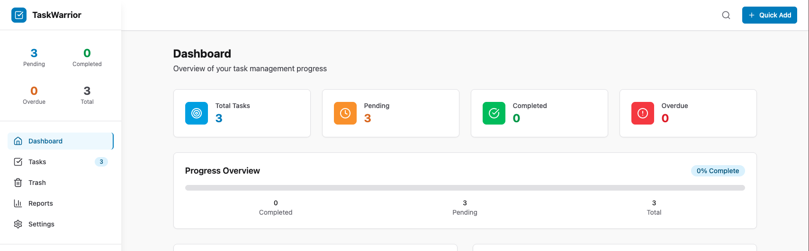

# TaskWarrior-NG

A modern full-stack web application for TaskWarrior task management with React frontend and MCP server backend.

TaskWarrior-NG provides a beautiful, responsive web interface for managing TaskWarrior tasks, combining the power of the command-line tool with a modern UI. Built with cutting-edge technologies and designed for productivity.

 

## ✨ Key Features

### 🎨 **Modern User Interface**
- Beautiful React UI with Tailwind CSS styling
- Responsive design that works on desktop, tablet, and mobile
- Dark/light theme support with system preference detection
- Intuitive navigation with real-time task counters

### 📋 **Comprehensive Task Management**
- **CRUD Operations**: Create, read, update, and delete tasks
- **Status Management**: Complete, uncomplete, start/stop task timers
- **Advanced Filtering**: Filter by status, project, tags, priority, and due dates
- **Search Functionality**: Full-text search across task descriptions
- **Priority & Urgency**: Visual indicators with color-coded priority levels
- **Project & Tag Organization**: Efficient categorization and grouping

### 🗑️ **Trash & Recovery System**
- **Smart Trash Management**: View and manage deleted tasks in a dedicated trash page
- **Individual Task Restoration**: Restore specific tasks with UUID-based reliability
- **Bulk Operations**: Select multiple deleted tasks for batch restoration
- **Advanced Selection**: 
  - Select All/None functionality
  - Shift+Click range selection
  - Keyboard shortcuts (Ctrl/Cmd+A, Escape)
- **Permanent Purge**: Safely remove deleted tasks permanently with confirmation

### ⚡ **Batch Operations**
- **Multi-Task Actions**: Complete, delete, start, stop, or modify multiple tasks at once
- **Filter-Based Operations**: Apply actions to tasks matching specific criteria
- **Smart Selection UI**: Interactive checkboxes with visual feedback
- **Progress Indicators**: Real-time feedback during bulk operations
- **Error Handling**: Detailed success/failure reporting for batch operations

### 📊 **Analytics & Insights**
- **Interactive Dashboard**: Real-time task analytics and progress tracking
- **Task Statistics**: Comprehensive summaries with pending, completed, and deleted counts
- **Project Analytics**: Per-project completion rates and statistics
- **Time Tracking**: Built-in timer functionality with session management
- **Visual Indicators**: Priority, urgency, and status visualization

### 🔧 **Advanced Features**
- **Real-time Updates**: Instant synchronization with TaskWarrior database
- **Robust Error Handling**: Graceful error recovery and user feedback
- **UUID Support**: Reliable task identification for all operations
- **Keyboard Navigation**: Productivity-focused keyboard shortcuts
- **Mobile Optimization**: Touch-friendly interfaces for mobile devices

## Architecture

```
taskwarrior-ng/
├── apps/
│   ├── frontend/          # React/TypeScript web application
│   │   ├── src/          # Frontend source code
│   │   ├── public/       # Static assets
│   │   └── package.json  # Frontend dependencies
│   ├── mcpo-wrapper/     # MCPO configuration and startup
│   │   ├── config.json   # MCP server configuration
│   │   ├── start-mcpo.sh # MCPO startup script
│   │   └── README.md     # MCPO wrapper documentation
│   └── mcp-server/       # TaskWarrior MCP server
│       ├── src/          # Python MCP server
│       └── config/       # Configuration files
├── start-dev.sh          # Development startup script
├── docs/                 # Documentation
└── README.md             # This file
```

### Component Communication

```
[React Frontend] <--> [MCPO REST API] <--> [MCP Server] <--> [TaskWarrior CLI]
   Port 3033         Port 8885/api/mcpo/     stdio            ~/.task/
                        taskwarrior/
```

**Technology Stack:**
- **Frontend**: React 18 + TypeScript + Vite + Tailwind CSS
- **API Layer**: MCPO (Model Context Protocol to OpenAPI)
- **MCP Server**: Python + FastMCP + Pydantic + tasklib
- **Backend**: TaskWarrior CLI + SQLite database
- **UI Components**: Custom component library with Lucide icons

## Quick Start

### Prerequisites

- Node.js 18+ and npm
- Python 3.8+ (Python 3.11+ recommended)
- TaskWarrior installed (`brew install task` on macOS)

### Installation

1. **Clone the repository:**
   ```bash
   git clone https://github.com/your-repo/taskwarrior-ng
   cd taskwarrior-ng
   ```

2. **Run the development environment:**
   ```bash
   ./start-dev.sh
   ```

   This will:
   - Check all dependencies
   - Install required packages
   - Start all servers
   - Open the application at http://localhost:3000

### Custom Ports

You can specify custom ports for the frontend and API servers:

```bash
# Default ports (3033 for frontend, 8085 for API)
./start-dev.sh

# Custom frontend port 8080, default API port
./start-dev.sh 8080

# Custom ports for both
./start-dev.sh 8080 8081

# Show help
./start-dev.sh --help
```

The script will:
- Validate port numbers (must be between 1024-65535)
- Check for port conflicts
- Update configuration files automatically
- Start servers with the specified ports
- Open the application in your default browser

## Development

### Manual Development Setup

If you prefer to start services individually:

#### Frontend Development

```bash
cd apps/frontend
npm install
npm run dev        # Start development server (default port 3033)
```

#### MCPO Server Development

```bash
cd apps/mcpo-wrapper
./start-mcpo.sh    # Start MCPO server (default port 8085)
```

#### MCP Server Development

```bash
cd apps/mcp-server
python -m venv venv
source venv/bin/activate  # On Windows: venv\Scripts\activate
pip install -r config/requirements.txt
python src/taskwarrior_mcp_server.py
```

### Configuration

#### Frontend Configuration
Create `apps/frontend/.env.local`:
```env
VITE_API_HOST=localhost
VITE_API_PORT=8885
VITE_API_PREFIX=/api/mcpo/taskwarrior
VITE_MCPO_API_KEY=taskwarrior-secret-key
```

#### MCPO Configuration
Environment variables for `apps/mcpo-wrapper/start-mcpo.sh`:
```env
MCPO_PORT=8885
MCPO_HOST=0.0.0.0
MCPO_PATH_PREFIX=/api/mcpo/
MCPO_API_KEY=taskwarrior-secret-key
```

## 🔌 API Reference

MCPO automatically exposes all MCP tools as RESTful endpoints at `/api/mcpo/taskwarrior/`:

### Task Operations
- `POST /api/mcpo/taskwarrior/list_tasks` - List tasks with filtering
- `POST /api/mcpo/taskwarrior/add_task` - Create new task
- `POST /api/mcpo/taskwarrior/get_task` - Get task details
- `POST /api/mcpo/taskwarrior/modify_task` - Update task properties
- `POST /api/mcpo/taskwarrior/delete_task` - Move task to trash
- `POST /api/mcpo/taskwarrior/complete_task` - Mark as completed
- `POST /api/mcpo/taskwarrior/uncomplete_task` - Revert to pending
- `POST /api/mcpo/taskwarrior/start_task` - Start task timer
- `POST /api/mcpo/taskwarrior/stop_task` - Stop task timer
- `POST /api/mcpo/taskwarrior/restore_task` - Restore from trash

### Batch Operations
- `POST /api/mcpo/taskwarrior/batch_complete_by_ids` - Complete multiple tasks
- `POST /api/mcpo/taskwarrior/batch_complete_by_filter` - Complete by filter
- `POST /api/mcpo/taskwarrior/batch_uncomplete_by_ids` - Uncomplete multiple
- `POST /api/mcpo/taskwarrior/batch_uncomplete_by_filter` - Uncomplete by filter
- `POST /api/mcpo/taskwarrior/batch_delete_by_ids` - Delete multiple tasks
- `POST /api/mcpo/taskwarrior/batch_delete_by_filter` - Delete by filter
- `POST /api/mcpo/taskwarrior/batch_start_by_ids` - Start multiple timers
- `POST /api/mcpo/taskwarrior/batch_stop_by_ids` - Stop multiple timers
- `POST /api/mcpo/taskwarrior/batch_modify_tasks` - Modify multiple tasks

### Metadata & Analytics
- `POST /api/mcpo/taskwarrior/get_projects` - List all projects
- `POST /api/mcpo/taskwarrior/get_tags` - List all tags
- `POST /api/mcpo/taskwarrior/get_summary` - Task statistics

### Maintenance Operations
- `POST /api/mcpo/taskwarrior/purge_deleted_tasks` - Purge trash
- `GET /docs` - OpenAPI documentation
- `GET /openapi.json` - OpenAPI specification

### Advanced Features
- **UUID Support**: All endpoints support both numeric IDs and UUIDs for reliability
- **Filter Support**: Advanced filtering by status, project, tags, priority, due dates
- **Error Handling**: Comprehensive error responses with detailed messages
- **Batch Processing**: Efficient handling of multiple task operations

## Documentation

- [Overview](apps/mcp-server/docs/OVERVIEW.md) - Project overview and architecture
- [Quick Start Guide](apps/mcp-server/docs/QUICKSTART.md) - Getting started quickly
- [Usage Examples](apps/mcp-server/docs/USAGE_EXAMPLES.md) - Common usage patterns
- [MCP Server README](apps/mcp-server/docs/README.md) - Detailed server documentation
- [MCP Implementation Guide](ai_docs/mcp_implementation_guide.md) - Technical MCP details
- [Tasklib Documentation](ai_docs/tasklib_documentation.md) - Taskwarrior Python library guide

## 📁 Project Structure

### **MCP Server** (`apps/mcp-server/`)
FastMCP-based Python server providing comprehensive TaskWarrior access:
- **19 MCP Tools**: Complete task operations including batch processing
- **3 Smart Prompts**: AI-powered task planning and analysis
- **3 Resources**: Formatted reports and live task data
- **Modular Architecture**: Dynamic loading with dependency injection
- **Pydantic Validation**: Type-safe parameter validation
- **UUID Support**: Reliable task identification

### **Frontend Application** (`apps/frontend/`)
Modern React application with TypeScript:
- **Component Library**: Reusable UI components with Tailwind CSS
- **State Management**: Zustand for efficient state handling
- **Routing**: React Router with nested layouts
- **Form Handling**: React Hook Form with validation
- **API Integration**: Type-safe API client with error handling

### **MCPO Wrapper** (`apps/mcpo-wrapper/`)
Configuration and startup for MCPO server:
- **Automatic API Generation**: MCP tools exposed as REST endpoints
- **OpenAPI Documentation**: Auto-generated API docs at `/docs`
- **Bearer Authentication**: Secure API access with tokens
- **CORS Support**: Configured for frontend integration

### **Tests** (`apps/tests/`)
Comprehensive test coverage:
- **Unit Tests**: Component and function testing
- **Integration Tests**: End-to-end workflow validation
- **MCP Tests**: Server functionality verification

## 🚀 User Experience

### **Intuitive Interface**
- **Clean Design**: Modern, distraction-free interface
- **Responsive Layout**: Optimized for all screen sizes
- **Accessibility**: WCAG-compliant design patterns
- **Keyboard Navigation**: Full keyboard support for power users

### **Productivity Features**
- **Quick Actions**: Fast task creation and modification
- **Smart Filtering**: Intelligent task organization
- **Bulk Operations**: Efficient multi-task management
- **Real-time Updates**: Instant feedback and synchronization

### **Safety & Reliability**
- **Trash System**: Safe deletion with recovery options
- **Data Validation**: Input sanitization and type checking
- **Error Recovery**: Graceful error handling with user feedback
- **UUID Tracking**: Reliable task identification across operations

## 🤖 AI Integration

TaskWarrior-NG is designed to work seamlessly with AI agents through the MCP protocol:

### Claude Desktop Integration
Add the MCP server to your Claude Desktop configuration:
```json
{
  "mcpServers": {
    "taskwarrior": {
      "command": "python",
      "args": ["/path/to/taskwarrior-ng/apps/mcp-server/src/taskwarrior_mcp_server.py"]
    }
  }
}
```

### Unified Backend
- **Same API**: Both web UI and AI agents use the same backend
- **Real-time Sync**: Changes made by AI are instantly visible in the web interface
- **Natural Language**: AI agents can manage tasks through conversation
- **MCP Protocol**: Industry-standard protocol for AI-tool integration

## 🛠️ Development

For development guidance with Claude Code, see [CLAUDE.md](CLAUDE.md).

## 📜 License

MIT License - See [LICENSE](LICENSE) file for details.